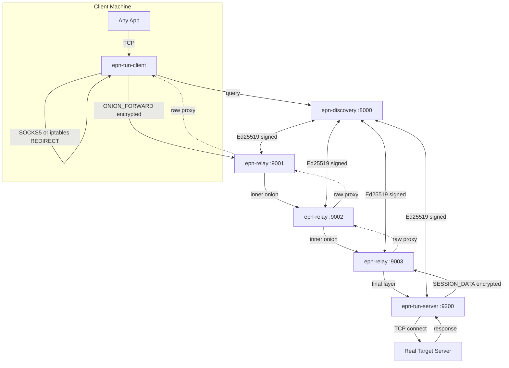

# EPN — Ephemeral Private Network

A production-grade onion-routing VPN stack in C++20. Every session uses unique ephemeral keys and a randomly-selected 3-hop relay path. All key material is destroyed after teardown.

---

## Architecture



---

## Components

| Binary | Role |
|--------|------|
| `epn-discovery` | Signed TTL-bounded node registry. Answers relay/server queries. |
| `epn-relay` | Onion node. Peels one X25519+ChaCha20 layer, connects to next hop, enters raw TCP proxy mode. |
| `epn-tun-server` | Exit node / TCP proxy. Decrypts final layer, connects to real targets, proxies data back. Multiplexes streams. |
| `epn-tun-client` | SOCKS5 proxy + persistent EPN session. Multiplexes all connections over one onion route. |
| `epn-tun-dev` | iptables setup tool. Installs rules for transparent proxying (no per-app config). |
| `epn-server` | Simple echo server (for testing / demonstration). |
| `epn-client` | One-shot ephemeral client (for testing). |

---

## Build

**System deps:** `libsodium-dev`, `cmake ≥ 3.20`, `g++ ≥ 13`

All other deps (asio, spdlog, CLI11, nlohmann_json, gtest) fetched via CMake FetchContent.

```bash
git clone <repo> epn && cd epn
mkdir build && cd build
cmake .. -DCMAKE_BUILD_TYPE=Release -DEPN_BUILD_TESTS=ON
make -j$(nproc)

# Optional post-quantum hybrid (X25519 + ML-KEM-768):
cmake .. -DEPN_ENABLE_PQ_CRYPTO=ON   # requires liboqs
```

---

## Usage — Mode 1: SOCKS5 Proxy (no root required)

```bash
# Terminal 1: discovery
./epn-discovery --port 8000

# Terminals 2-4: relay nodes
./epn-relay --port 9001 --disc-port 8000
./epn-relay --port 9002 --disc-port 8000
./epn-relay --port 9003 --disc-port 8000

# Terminal 5: tunnel server (exit node + TCP proxy)
./epn-tun-server --port 9200 --disc-port 8000

# Terminal 6: tunnel client — SOCKS5 on localhost:1080
./epn-tun-client --disc-port 8000 --socks-port 1080

# Now route any app through EPN:
curl --socks5 127.0.0.1:1080 https://example.com
curl --socks5 127.0.0.1:1080 http://api.target.local/v1/data

# Or configure system SOCKS5 proxy in OS network settings
# All SOCKS5-aware apps work automatically (browsers, curl, wget, etc.)
```

Or use the quick-start script:
```bash
./scripts/epn-start.sh
```

---

## Usage — Mode 2: Transparent VPN (requires root for iptables)

All TCP traffic is intercepted automatically — no per-app configuration.

```bash
# Terminal 1-5: same infrastructure as above (discovery + 3 relays + tun-server)

# Terminal 6: Install iptables redirect rules (once, as root)
sudo ./epn-tun-dev setup --tproxy-port 1081

# Terminal 7: tunnel client in transparent mode
./epn-tun-client --disc-port 8000 --transparent --tproxy-port 1081

# Now ALL TCP traffic from this machine routes via EPN:
curl https://example.com           # no --socks5 needed
wget http://target.internal/file   # transparent
ping is NOT tunneled (UDP/ICMP)    # only TCP

# Clean up iptables when done:
sudo ./epn-tun-dev teardown
```

### iptables rules installed by `epn-tun-dev setup`:
```
EPN_REDIRECT chain:
  RETURN  loopback (lo)
  RETURN  127.0.0.0/8, 10.0.0.0/8, 172.16.0.0/12, 192.168.0.0/16
  RETURN  mark 0xEAB5  (EPN's own TCP connections — prevents loop)
  REDIRECT → port 1081  (all other TCP)

OUTPUT chain:
  -p tcp -j EPN_REDIRECT
```

---

## Stream Multiplexing Protocol

Multiple TCP connections share a single EPN session (one onion route). Each connection is a **stream** identified by a 32-bit ID.

Inside each `SESSION_DATA` AEAD payload:

```
[4B stream_id BE][1B cmd][2B data_len BE][data...]
```

| Cmd | Value | Direction | Payload |
|-----|-------|-----------|---------|
| STREAM_OPEN | 0x01 | client→server | `[1B addr_type][addr][2B port]` |
| STREAM_DATA | 0x02 | bidirectional | raw TCP bytes |
| STREAM_CLOSE | 0x03 | bidirectional | empty |
| STREAM_OPEN_ACK | 0x04 | server→client | `[1B result: 0=OK, 1=refused, 2=unreachable]` |

Stream IDs are odd (client-initiated), starting at 1 and incrementing by 2 per new connection.

---

## Cryptography

| Primitive | Usage |
|-----------|-------|
| X25519 | Per-hop ephemeral DH key agreement |
| HKDF-SHA256 | Key derivation: `forward_key = HKDF(DH_output ∥ epk ∥ npk, "epn-forward-v1", 32)` |
| ChaCha20-Poly1305-IETF | AEAD for onion layers + SESSION_DATA (12-byte counter nonce, 16-byte tag) |
| Ed25519 | Discovery announcement signing |
| BLAKE2b-256 | NodeId derivation from DH pubkey |

**Anti-replay:** `EphemeralKeyTracker` (120s sliding window) per relay. Replayed onion packets are silently dropped.

**Zeroization:** All key types (`X25519KeyPair`, `SessionKey`, `SecretBytes`) call `sodium_memzero` in their destructors.

---

## Session Lifecycle

```
1. [Server/Relay] → signed NodeAnnouncement (Ed25519) → Discovery (TTL 60s)
2. [Client]       → query Discovery for relays + server
3. [Client]       → generate ephemeral X25519 keypair per hop
                  → HKDF-derive forward+backward keys per hop
                  → encrypt payload in layers (server innermost → relay1 outermost)
                  → build_onion() returns wire bytes + E2E server session key
4. [Client]       → TCP connect to relay1, send ONION_FORWARD
5. [Relay1..N]    → peel one layer → connect next hop → enter raw TCP proxy mode
6. [Server]       → peel final layer → derive same E2E key → send ROUTE_READY
7. [Data plane]   → SESSION_DATA frames flow: ChaCha20-Poly1305 E2E encrypted
                  → relays see only ciphertext; they proxy raw bytes transparently
8. [Streams]      → each SOCKS5/transparent connection = STREAM_OPEN/DATA/CLOSE triple
                  → multiplexed over the single persistent EPN session
9. [Teardown]     → TEARDOWN frame → sodium_memzero on all session key material
```

---

## Threat Model

**Protected against:**
- Passive eavesdropper between any two hops (layered AEAD)
- Single relay compromise (knows only prev/next hop address)
- Replay attacks (ephemeral pubkey tracker + TTL-bounded announcements)
- Key reuse (fresh X25519 ephemeral per session, per hop)

**Not protected against (documented):**
- Global passive traffic correlation (timing analysis)
- Sybil attacks on discovery (no stake/reputation mechanism)
- DoS at relay level (no per-source rate limiting)
- DNS traffic (transparent mode only intercepts TCP; DNS is UDP)

---

## Tests

```bash
cd build
./tests/epn-tests          # 33/33 unit tests
ctest --output-on-failure  # same via CTest
```

| Suite | Count | Coverage |
|-------|-------|----------|
| CryptoTest | 15 | X25519, HKDF, AEAD, Ed25519, nonce monotonicity, zeroization |
| ProtocolTest | 6 | Frame encode/decode, truncation, peek |
| OnionTest | 5 | 1-hop + 3-hop peel, wrong-key rejection, anti-replay |
| DiscoveryTest | 7 | Registry CRUD, sig rejection, expiry, JSON round-trip |

---

## File Structure

```
epn/
├── libs/
│   ├── epn-core/          Types, Result<T>, hex/BE helpers
│   ├── epn-crypto/        X25519, HKDF-SHA256, ChaCha20-Poly1305, Ed25519
│   ├── epn-protocol/      Frame codec, onion construction/peeling
│   ├── epn-transport/     Async TCP (Asio strands), write queue, raw proxy
│   ├── epn-discovery/     Registry, discovery client, announcement signing
│   ├── epn-routing/       Route planner, relay selection, BuiltRoute
│   ├── epn-tunnel/        Stream multiplexing protocol (STREAM_OPEN/DATA/CLOSE)
│   └── epn-observability/ Structured logging (spdlog)
├── apps/
│   ├── epn-discovery/     Discovery registry server
│   ├── epn-relay/         Onion relay node
│   ├── epn-server/        Echo server (testing)
│   ├── epn-client/        One-shot client (testing)
│   ├── epn-tun-server/    Tunnel exit node + TCP proxy
│   ├── epn-tun-client/    SOCKS5 + transparent proxy + EPN session manager
│   └── epn-tun-dev/       iptables setup/teardown tool (requires root)
├── scripts/
│   ├── epn-start.sh       Launch full system
│   ├── epn-setup.sh       Install iptables rules (root)
│   └── epn-teardown.sh    Remove iptables rules (root)
└── tests/
    ├── test_crypto.cpp
    ├── test_protocol.cpp
    └── test_routing.cpp
```

---

## Roadmap

| Feature | Status |
|---------|--------|
| X25519 + HKDF + ChaCha20-Poly1305 | ✅ |
| Ed25519 discovery signing | ✅ |
| 3-hop onion routing E2E | ✅ |
| Anti-replay ephemeral key tracker | ✅ |
| Session TTL enforcement | ✅ |
| SOCKS5 proxy (no root) | ✅ |
| Stream multiplexing over single EPN session | ✅ |
| iptables transparent TCP proxy (root) | ✅ |
| Post-quantum hybrid ML-KEM-768 | 🔧 `EPN_ENABLE_PQ_CRYPTO=ON` |
| TUN device (packet-level VPN, no iptables) | 📋 |
| UDP tunneling | 📋 |
| DNS over EPN (prevent DNS leaks) | 📋 |
| DHT/gossip discovery (decentralised) | 📋 |
| Traffic padding (fixed-size cells) | 📋 |
| Multi-path / redundant routes | 📋 |
